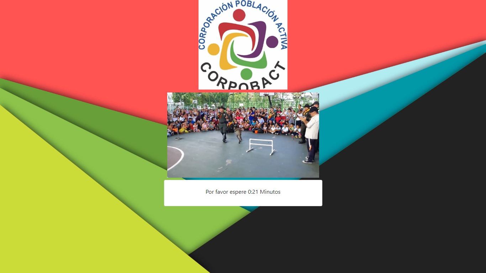

# Sistema de captura de información Mikrotik

Permite capturar datos de usuarios que vayan a registrarse, para que así puedan acceder a internet gratuito.




### Requisitos:

1. Servidor Apache, MySQL y PHP 5.4 en adelante (Hosting externo).
2. Router Mikrotik.
3. Conexión a internet (o a servidor en caso de ser local).

### Configuración previa:

1. Descargue los archivos, puede borrar la carpeta **/examples** que incluye solo las imágenes de apoyo.

2. Crear base de datos, usuario de base de datos, contraseña y asignar permisos.

3. Popular la base de datos anteriormente creada.

   ```mysql
   CREATE TABLE `mikrotiks` (
     `id` int(11) NOT NULL,
     `name` varchar(100) NOT NULL
   ) ENGINE=MyISAM DEFAULT CHARSET=latin1;
   
   INSERT INTO `mikrotiks` (`id`, `name`) VALUES
   (1, 'Mikrotik Demo');
   
   CREATE TABLE `users` (
     `id` int(11) NOT NULL,
     `identification` varchar(50) COLLATE utf8_unicode_ci NOT NULL,
     `name` varchar(150) COLLATE utf8_unicode_ci NOT NULL,
     `phone` varchar(50) COLLATE utf8_unicode_ci NOT NULL,
     `email` varchar(100) COLLATE utf8_unicode_ci NOT NULL,
     `birthday` varchar(150) COLLATE utf8_unicode_ci NOT NULL,
     `mktid` int(11) NOT NULL,
     `created` varchar(50) COLLATE utf8_unicode_ci NOT NULL
   ) ENGINE=InnoDB DEFAULT CHARSET=utf8 COLLATE=utf8_unicode_ci;
   
   ALTER TABLE `mikrotiks`
     ADD PRIMARY KEY (`id`);
   
   ALTER TABLE `users`
     ADD PRIMARY KEY (`id`);
   
   ALTER TABLE `users`
     MODIFY `id` int(11) NOT NULL AUTO_INCREMENT, AUTO_INCREMENT=1;
   COMMIT;
   ```

4. Configurar archivo conf.php

   ```php
   define("DB_DB",""); //Define nombre base de datos
   define("DB_USER",""); //Define usuario de base de datos
   define("DB_PASS",""); //Define contraseña base de datos
   define("DB_HOST","127.0.0.1"); //Define host base de datos
   define("DB_PORT","3306"); //Define puerto base de datos
   define("DB_DRIVER","mysql"); //Define driver de base de datos
   ```

5. Configurar Mikrotik, se muestra un ejemplo estándar, se deben cambiar las variables en cada caso particular.

   ```python
   #Direccion del servidor donde esta alojado los archivos php
   :global Server "x.x.x.x"
   
   #Nombre asignado a Mikrotik
   :global Name "xxx"
   
   /interface bridge
   add name=bridge1
   /interface wireless
   set [ find default-name=wlan1 ] disabled=no mode=ap-bridge ssid=PRUEBAS
   /interface wireless security-profiles
   set [ find default=yes ] authentication-types=wpa2-psk eap-methods="" \
       supplicant-identity=MikroTik wpa2-pre-shared-key=123456789
   /ip pool
   add name=dhcp_pool0 ranges=10.0.0.2-10.0.0.254,10.0.1.2-10.0.1.254
   add name=dhcp_pool1 ranges=10.6.0.2-10.6.0.254
   /ip dhcp-server
   add address-pool=dhcp_pool0 disabled=no interface=bridge1 lease-time=1d10m \
       name=dhcp1
   add address-pool=dhcp_pool1 disabled=no interface=ether4 lease-time=1d10m \
       name=dhcp2
   /ip hotspot user profile
   add address-pool=dhcp_pool0 mac-cookie-timeout=1d name=Trial rate-limit=2M/2M \
       shared-users=1000 transparent-proxy=yes
   /ip hotspot profile
   add dns-name=portal.pruebas.com hotspot-address=10.0.0.1 \
       http-cookie-lifetime=12h login-by=cookie,http-chap,trial name=hsprof1 \
       rate-limit=2M/2M trial-uptime-reset=0s trial-user-profile=Trial
   /ip hotspot
   add address-pool=dhcp_pool0 addresses-per-mac=1 disabled=no interface=bridge1 \
       name=hotspot1 profile=hsprof1
   /interface bridge port
   add bridge=bridge1 interface=ether2
   add bridge=bridge1 interface=ether3
   add bridge=bridge1 interface=ether5
   add bridge=bridge1 interface=wlan1
   /ip address
   add address=10.6.0.1/24 comment=Gestion interface=ether4 network=10.6.0.0
   add address=10.0.0.1/23 comment="Red Hotspot" interface=bridge1 network=\
       10.0.0.0
   /ip dhcp-client
   add dhcp-options=hostname,clientid disabled=no interface=ether1
   /ip dhcp-server network
   add address=10.0.0.0/23 dns-server=8.8.8.8 gateway=10.0.0.1
   add address=10.6.0.0/24 dns-server=8.8.8.8 gateway=10.6.0.1
   /ip dns
   set servers=8.8.8.8
   /ip firewall filter
   add action=passthrough chain=unused-hs-chain comment=\
       "place hotspot rules here" disabled=yes
   add action=accept chain=input dst-port=2345 protocol=tcp
   add action=accept chain=input dst-port=90 protocol=tcp
   add action=accept chain=input dst-port=8292 protocol=tcp
   add action=accept chain=input connection-state=established,related
   add action=drop chain=input
   /ip firewall nat
   add action=passthrough chain=unused-hs-chain comment=\
       "place hotspot rules here" disabled=yes
   add action=masquerade chain=srcnat out-interface=ether1
   /ip hotspot user
   add name=admin password=123456789
   /ip hotspot walled-garden
   add comment="place hotspot rules here" disabled=yes
   /ip hotspot walled-garden ip
   add action=accept disabled=no dst-address=$Server !dst-address-list \
       !dst-port !protocol !src-address !src-address-list
   /ip service
   set telnet disabled=yes
   set ftp disabled=yes
   set www port=90
   set ssh port=2345
   set api disabled=yes
   set winbox port=8292
   set api-ssl disabled=yes
   /system clock
   set time-zone-name=America/Bogota
   /system identity
   set name=$Name
   ```

6. Subir la carpeta, exceptuando la subcarpeta **/process** al directorio **/hotspot** del mikrotik

7. Subir la carpeta **/process** al servidor donde esta alojado PHP+Apache+MySQL.

8. Editar el archivo login.html de la carpeta **/hotspot**

   1. La línea 128 contiene el ID del mikrotik, este valor debe ser igual al registrado en la tabla **mikrotiks** para evitar su duplicación y poder separar los datos después.

      ```php+HTML
      <input type="hidden" class="form-control" id="MktId" value="1">
      ```

   2. La línea 183 contiene la duración mínima que el usuario debe esperar para acceder al boton de conectarse.

      ```javascript
      var seconds = 25; //número de segundos a contar
      ```

   3. La línea 218 y 260 contiene la URL  a la que se va a acceder para el procesamiento de los datos

      ```javascript
      url: 'http://dominio.com/process/ajaxUser.php',
      ```

9. Se puede cambiar el video, entrando al directorio **/video** al igual que el logotipo entrando al directorio **/img** y cambiando la imagen **logo.jpg**
